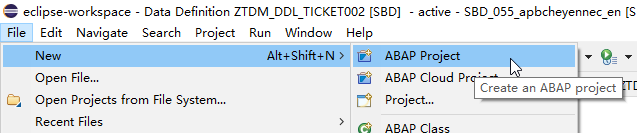
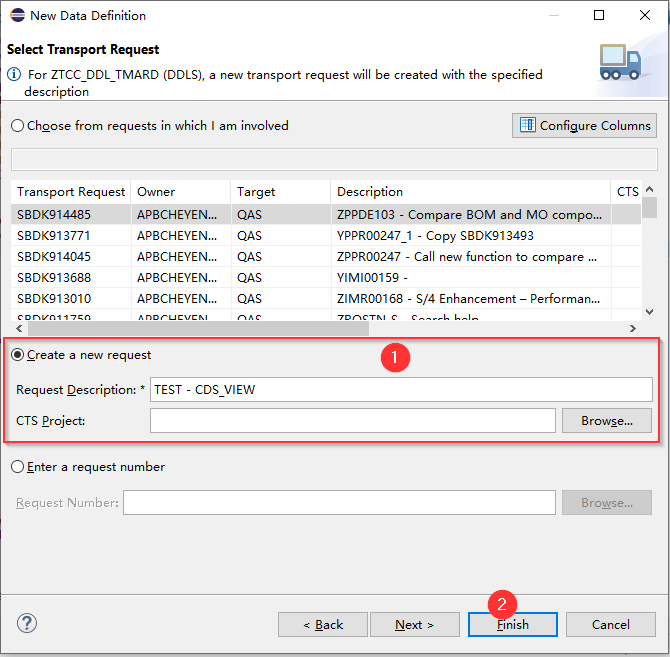
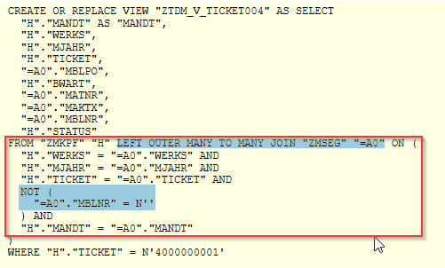

 **ABAP CDS VIEW Training**

# 1.基础概念


## 1.0 背景

结构化查询语言 Structured Query Language (SQL)

SQL的三种子语言

**Data ManipulationLanguage (DML)**

​	提供用于读取和更改数据库表和的内容的语句

​	包含SELECT、INSERT、UPDATE和DELETE等语句。

**Data DefinitionLanguage (DDL)**

​	提供用于创建数据库对象（如表和视图）并维护其属性的语句。

**DataControl Language (DCL)**

​	涵盖数据完整性和安全性的各个方面。


而 OpenSQL 是 ABAP 语言中内置 的 SQL 变体，仅涵盖 DML 方面。
且 OpenSQL 不仅将自己限制在 SQL 的 DML 部分, 对比MySQL，Oracle时，
Open SQL 中也缺少许多描述的 DML 功能 限制了很多的功能，例如 limit , Union 

**这些限制有两个重要原因：**

​	OpenSQL希望独立于数据库，不仅在语法方面，而且更重要的是在结果方面。必须保证 OpenSQL 语句在所有数据库上提供相同的结果。要做到这一点，最简单的方法是避免标准 SQL的那些特性，在这些特性中，数据库供应商对结果应该是什么样子有不同的看法。一个 例子是算术表达式，其中舍入规则在所有数据库上都不相同。

​	ABAP 编程的基本性能规则始终是：使不必要的负载远离数据库。一般的假设是，应用程序 程序员遵循此规则，不会过多地使用更复杂的 SQL 功能，即使它们在 OpenSQL 中可用


**SAPHANA和对代码到数据的需求**
 从版本 7.4 开始，ABAP 系统完全支持 SAPHANA 时，这一切都发生了变化。

借助 SAPHANA，SAP 结合了硬件和软件技术的最新发展，以提供最先进的内存数 据库。 但是，SAPHANA不仅仅是一个数据库。多个数据分析引擎和内置应用程序平台允许在数据库层 本身执行详细的数据分析甚至应用程序逻辑。

为了从SAPHANA的功能中获得最大收益，有必要改变编程范式以及传统的应用程序设计。


**为什么会有ABAP CDS VIEW?**

ABAP Core Data Services (CDS) View是SAP为解决数据访问和数据模型复杂性问题而引入的。传统上，ABAP开发人员不得不在代码中将业务逻辑和数据库操作混合在一起，这会导致代码难以理解和维护。此外，业务逻辑和数据模型也常常分散在多个地方，这会导致数据的一致性问题。

为了解决这些问题，ABAP CDS View被引入，它允许开发人员在较高的抽象层次上定义数据模型和业务逻辑，这样可以让代码更容易理解和维护。同时，由于CDS View可以直接在数据库层面上进行操作，因此也能大幅提升性能表现。


## 1.1 什么是 ABAP CDS_VIEW

**CDS: Core Data Services** 核心数据服务 （数据 + 服务）

包含了： DDL ： （model，数据定义）

​	         QL： （Query Language 查询） open SQL 可以访问CDS view 

​		DCL：  CDS权限定义 


CDS VIEW 简单来说就是一个 VIEW, 

区别于原来的 ABAP VIEW,：支持更多的功能，完成更复杂的 VIEW
										（例如，增加了 外连接，Union，但不仅于此） 


​	


## 1.2 ABAP CDS / HANA CDS

- ABAP CDS VIEW :

是为了帮助我们在 ABAP 服务器上开发，完成代码下推的一种方式，（可以不只运用于 HANA 数据库）

（Code Push Down）将部分逻辑从AP推送到DB层，更好的发挥 SAP HANA 的运算能力

https://help.sap.com/docs/ABAP_PLATFORM/f2e545608079437ab165c105649b89db/4ed1f2e06e391014adc9fffe4e204223.html?locale=en-US

- HANA CDS VIEW

借助VDM, 运用 HANA 数据库上，完成数据建模 

属于 HANA 数据库的一部分，  位于HANA XS层(HANA Extended Application Services), 其就是为了创建HANA数据库里的模型和开发原生的HANA应用而生的，使用NATIVE SQL, 脱离了HANA数据库单独谈HANA CDS view没有任何意义。

https://help.sap.com/docs/SAP_HANA_PLATFORM/52715f71adba4aaeb480d946c742d1f6/421691c7c0514928b3f15030600ef964.html?locale=en-US


#### 1.相同点

- 都是代码下推的一种方式，HANA CDS VIEW 更多为了帮助S4/HANA 系统实现代码下推


#### 2.不同点

- 位置： ABAP CDS VIEW 位于 ABAP 应用服务器中 ； HANA CDS VIEW 位于 HANA XS Services 内

- 查看： ABAP CDS VIEW 可以用 SE11 查看 SQL View，； 
- 数据源： ABAP CDS VIEW 还是我们 ABAP OPEN SQL 的； HANA CDS VIEW  是 HANA 数据中(Native SQL )
- 使用：ABAP CDS VIEW 用于开发 ABAP 技术栈的应用程序；HANA CDS View 用于开发 HANA 原生应用
- 编写：基本关键字差不多，语法使用不同


## 1.3 ABAP CDS VIEW 作用 & 好处


1.因为是编译运行在 DB 层，相对AP 层会更快

2.代码下移，可以将一些AP层的逻辑下放到 DB 层帮忙处理

​	数据密集型的计算会下推到数据库层

3.OData / Fiori  的开发需要用到 CDS_VIEW ,  

​	Fiori Element


## 1.4 ABAP CDS VIEW 是怎么运行到HANA 数据库中的

ABAP CDS View是在ABAP环境中定义和开发的数据服务视图。当你创建一个ABAP CDS View并在你的程序中调用它时，ABAP运行环境会将这个CDS视图转化为SQL语句，并在关联的HANA数据库上执行。


# 2.创建

 

## 2.1基本环境

（官方说明是可以在 Eclipse 或者 HanaStudio  进行开发）

如下是安装Eclipse 的步骤：（建议去官网参照最新的步骤）


### 2.1.1 安装 Eclipse

[SAP HANA工具官方链接](https://tools.hana.ondemand.com/#abap)

（Ctrl + ‘左键’）


### 2.1.2 安装 ADT 插件

Abap Devolopment Tools 

**【注意】**如果不是最新的Eclipse版本，需要选择对应的ADT版本，不能直接使用

安装步骤包含在上图


### 2.1.3 创建ABAP Project

安装ADT 成功后，可以开始新建 ABAP Project:

步骤：File ==> New ==> ABAP Project (/Project)

​	


然后选中我们登入的环境和端口：一直 Next 就行

（这里应该是ADT 直接从GUI 的配置文件中带出来的）

​	


## 2.2 创建 CDS VIEW


#### 2.2.1 Creating Data Definitions

- 1.新建项目


- 2.找到  **Core Data Services** >> **Data Definition** 


- 3.除了Project和Package，输入要创建的数据定义的Name和Description。然后点击下一步。


- 这里也可以点击 next ,去选中需要的模板，或者 Finish （默认用上一次使用的模板）


- 4.如果选择了非本地Package，需要选择TR（选择已有TR,或者新建）后，点击完成



- 4.1扩展（可以选择Next 后，选择不同模板有什么效果）这里是直接Finsih,用了最基础的模板
- 5.完成创建，这就是创建的基础框架，后续补充我们需要代码


#### 2.2.2  Demo 示例

##### Demo 1 

需求：查询 Ticket 的相关数据，把表 ZMKPF & ZMSEG 的数据一张 View 输出  （ZTDM_DDL_TICKET001）

```ABAP
@AbapCatalog.sqlViewName: 'ZTDM_V_TICKET001' //指定了数据库 CDS SQL View 的名字
@AbapCatalog.compiler.compareFilter: true
@AbapCatalog.preserveKey: true
@AccessControl.authorizationCheck: #NOT_REQUIRED
@EndUserText.label: 'TEST - DEMO 2.1'
define view ZTDM_E_Ticket001 //指定CDS View Entity 的名字，
  as select from    zmkpf as H
    left outer join zmseg as I on  H.werks  = I.werks
                               and H.mjahr  = I.mjahr
                               and H.ticket = I.ticket
{
  key H.werks,
  key H.mjahr,
  key H.ticket,
  key I.mblpo,
      H.bwart,
      I.matnr,
      I.maktx,
      I.mblnr,
      H.status
}
where
  H.ticket = '4000000001'
```

##### Demo 2 

需求：查询MARD中指定Plant,库存大于0的物料数据 , ( ZTDM_DDL_MARD001 )

```ABAP
@AbapCatalog.sqlViewName: 'ZTDM_V_MARD001'
@AbapCatalog.compiler.compareFilter: true
@AbapCatalog.preserveKey: true
@AccessControl.authorizationCheck: #NOT_REQUIRED
@EndUserText.label: 'TEST - DEMO 2.2'
define view ZTDM_E_MARD001
  with parameters
    p_Werks : werks_d // 参数名区分大小写
  as select from nsdm_v_mard as M // DB的MARD 与 AP的MARD 数据源不同
{
      @EndUserText.label: 'Plant'
  key M.werks,
      @EndUserText.label: 'Storage location'
  key M.lgort,
      @EndUserText.label: 'Material Number'
  key M.matnr,
      @EndUserText.label: 'Valuated Unrestricted-Use Stock'
      M.labst,
      @EndUserText.label: 'Stock in Quality Inspection'
      M.insme,
      @EndUserText.label: 'Blocked Stock'
      M.speme
}
where
       werks = $parameters.p_Werks
  and(
       labst > 0
    or insme > 0
    or speme > 0
  )
```


## 2.3 CDS_VIEW 基本代码框架


【注解】 **@AbapCatalog.sqlViewName:**  指定了数据库 CDS SQL View的名字，在CDS View激活时，会在数据库层生成对应的SQL View , 和 ABAP SQL View  一样，（最长16个字符，且都为大写 ）

【注解】**@AbapCatalog.preserveKey: true** 注解的值为TRUE时，SQL view中的key字段使用CDS中定义的key； 值为FALSE时，使用DB table中table的key field.

【注解】**@AccessControl.authorizationCheck: #NOT_REQUIRED** 权限检查注解，NOT_REQUIRED 为有对应的权限管控时则会执行权限检查，否则不执行

【基本定义】

**define view ZMM_DDL_DEMO** : 定义的CDS View的名字，CDS View 实体名 

```abap
as select from    zmseg as I
  left outer join zmkpf as H on  H.werks  = I.werks
                             and H.mjahr  = I.mjahr
                             and H.ticket = I.ticket
```

**as select from** : 指定了CDS View的数据源

**{ }** : 中定义了CDS view中包含哪些字段

**where :** 指定查询的条件  (where 不是必需的)


【注意】命名时：SQL View name 最长16位字符；全大写

​			       CDS View name最长30位字符，区分大小写可以使用驼峰命名


## 2.4 DDIC 上的三个工件

帮助理解 CDS VIEW


#### 基本概念

**DDL Source** 源代码文件:  

​	激活 DDL 源后，将创建两个对象：SQL 视图和 CDS 视图。它们都不能直接编辑


**CDS View Entity**：（建议使用这个作为SQL 中的数据源）

​	相对SQL 视图具有更多的语义，但不能在SE11 直接查看数据，
​	可以在 SQL中使用

​	CDS 实体的名称在 DEFINEVIEW 语句之后指定

​	

**SQL View** : 显示为数据字典对象  ，可以用于再SE11查看数据，（注：带参数的不能查看数据)

​	SQL 视图的名称在 Annotation@ABAPCatalog.sqlViewName 之后指定。它必须与 CDS 实体 的名称不同。与任何词典视图一样，最大长度为 16 个字符。


# 3.语法 & 语义


## 3.1基本表达式


```
(先说明，CDS VIEW 还是属于SAP, ABAP 里有的元素 它一样都拥有，Field ,Data Element）
(使用时，可以借助 F2 快捷键 查看元素内容)
```


### 3.1.0 值

- 系统值

|                |                                                              |
| -------------- | ------------------------------------------------------------ |
| $projection. : | 代指当前CDS VIEW , 可以用来指向当前CDS VIEW 的栏位、参数     |
| $session.      | 类似ABAP 的 sy-  , 使用系统变量的header<br /> 例如：当前日期：$session.system_date<br />             当前端口：$session.clint<br />             系统语言：$session.system_language<br />             登录用户：$session.user |

​	

- 常量

1.使用 单引号包起来的则为 字符， 

​	根据是否为纯数字 分为 Char 、Numc

2.不使用单引号包起来的，则为数字，允许有小数点，

```ABAP
{
  'ABCD字' as Field1,  //char
  '123.22' as Field2, //numc
  // 123.ss 因为有字符，则必须用单引号包起来
  123 as Field3,      //int
  1234 as Field4,
  32767 as Field5,
  32768 as Field6,    // 待验证是否会根据值变换 字符类似(Int1/Int4)
  123.22 as Field7,

}
```

可以用于后续，AP层 循环里面根据某个值判定为某种类型、


### 3.1.1 Build-in

描述：CDS中自带的一些运算函数

```
使用：

- **concat ( )** 拼接两个字符串，
- **substring( )** 获取字符串中的一个子串。
- 更多可用的Build-in函数可以查找ABAP的帮助文档

div(arg1,arg2):输入整数，整除；

mod(arg1,arg2):输入整数，取余；

division(arg1,arg2,dec):输入整数或小数，除法；

abs(arg):取绝对值；

floor(arg):向下取整；

ceil(arg):向上取整；

round(arg,pos):四舍五入，pos保留小数位；

concat(arg1,arg2):字符拼接；

replace(arg1,arg2,arg3):使用arg3替换arg1中所有arg2;

substring(arg,pos,len):从pos开始，截取len长度；

concat_with_space(arg1,arg2,count):使用count个space连接arg1,arg2；

length(arg):返回长度；

left(arg,n):左边n个字符；

right(arg,n):右边n个字符；

lower(arg)：转换小写，numc,dats,tims不允许输入；

upper(arg):转换大写，numc,dats,tims不允许输入；

unit_conversion():单位转换，

Tcode:CUNI维护单位；

currency_conversion():币别转换，

Tcode:OB08,维护币别；
```


可参考链接：

[ABAP - Help](adtcom:/sap/bc/adt/docu/abap/langu?object=abenabap&sap-language=EN&version=X) > [ABAP - Core Data Services (ABAP CDS)](adtcom:/sap/bc/adt/docu/abap/langu?object=abencds&sap-language=EN&version=X) > [ABAP CDS - Data Definitions](adtcom:/sap/bc/adt/docu/abap/langu?object=abencds_entities&sap-language=EN&version=X) > [ABAP CDS - DDL for Data Definitions](adtcom:/sap/bc/adt/docu/abap/langu?object=abencds_f1_ddl_syntax&sap-language=EN&version=X) > [ABAP CDS - CDS Entities](adtcom:/sap/bc/adt/docu/abap/langu?object=abencds_view_entity&sap-language=EN&version=X) > [ABAP CDS - DDIC-Based Entities](adtcom:/sap/bc/adt/docu/abap/langu?object=abencds_ddic_entity&sap-language=EN&version=X) > [ABAP CDS - DDIC-Based Views](adtcom:/sap/bc/adt/docu/abap/langu?object=abencds_v1_views&sap-language=EN&version=X) > [CDS DDL - DEFINE VIEW ddic_based](adtcom:/sap/bc/adt/docu/abap/langu?object=abencds_define_view_v1&sap-language=EN&version=X) > [CDS DDL - DDIC-based View, SELECT](adtcom:/sap/bc/adt/docu/abap/langu?object=abencds_select_statement_v1&sap-language=EN&version=X) > [CDS DDL - DDIC-based View, SELECT, Operands and Expressions](adtcom:/sap/bc/adt/docu/abap/langu?object=abencds_operands_and_expr_v1&sap-language=EN&version=X) > [CDS DDL - DDIC-based View, Expressions](adtcom:/sap/bc/adt/docu/abap/langu?object=abencds_expressions_v1&sap-language=EN&version=X) > [CDS DDL - DDIC-Based View, Built-In Functions](adtcom:/sap/bc/adt/docu/abap/langu?object=abencds_builtin_functions_v1&sap-language=EN&version=X) > [CDS DDL - DDIC-based View, sql_functions](adtcom:/sap/bc/adt/docu/abap/langu?object=abencds_sql_functions_v1&sap-language=EN&version=X) > 


### 3.1.2 Case

描述：实现分支结构

使用：

- case...when...else...end as 构成分支运算的逻辑
- when 语句中可以是逻辑表达式
- else 最后没有找到时 ，Finally
- end as 赋值结果


基本语法

```ABAP
case field
  when 'A' then 'A1'
  when 'B' then 'B2'
  else result 
END AS field2 // 重点记得最后给上目标栏位

case $parameters.P_SOFLG 
  when '' then mska.kalab
end as kalab,  
```

复杂嵌套语法;  加上判断条件，if , and

```
case 
    when mard.werks = 'F137' AND mard.lgort > 'W101' then mard.labst
```


例，如下需求，不用单独为了如下功能加上一段循环，（具体情况具体分析）

​	


### 3.1.3 Cast 类型转换

描述：强制类型转换

- CAST可以完成所需要的强制类型转换，进而实现在CDS中的运算需求；
- 其中abap.fltp代表转换为abap中的浮点型


```abap
case smoker
            when 'X' then cast ( forcuram as abap.fltp ) * 1.3
            else          cast ( forcuram as abap.fltp ) * 0.9
            end as final_amount
```


### 3.1.4 COALESCE函数

描述：常用用户处理NULL的状况，为NULL语设定默认值

- coalesce（arg1, arg2）: 如果arg1不为NULL则返回arg1的值，否则返回arg2的值

```abap
coalesce( smoker,  'unassigned') as somker_status
```


### 3.1.5 聚集

描述：帮助完成聚集运算，例如MIN，MAX，COUNT，SUM等

```abap
{
  planetype,
  min(price) as min_price,
  max(price) as max_price,
  sum(price) as sum_price,
  count(*)   as count_planes  /* 总条数 */

}
group by
  planetype
```

使用：使用聚集运算时，可以使用group by指定聚集的条件，也即按哪些字段进行分组统计。


#### 3.1.5.1 Having语句

描述：指定聚集运算过程中的筛选条件

```abap
group by
  planetype
having
  planetype = '747-400'
  or count(*)  > 60
```

使用：

- Having中指定的条件字段，只能是group by中的字段的子集（对结果进行筛选）；
- 在Having中也可以使用聚集运算的中间结果集作为删选条件


### 3.1.6 join

描述：与ABAP的连接一致，

- CDS支持Inner Join， Left Outer Join，Right Outer Join

```abap
  as select from    zmseg as I
    left outer join zmkpf as H on  H.werks  = I.werks
                               and H.mjahr  = I.mjahr
                               and H.ticket = I.ticket
```


### 3.1.7 UNION

描述：UNION两个SELECT的结果集

使用：

- **UNION** 可以合并两个SELECT的结果集，并自定去除重复的条目
- **UNION ALL** 合并结果集，保留重复的条目
- 合并的两个结果集要有相同字段数（*不同会怎么样*？）
- 合并结果集的列类型要兼容（*不同以哪个为主？*）
- 字段名称要相同

```abap
 as select distinct from sbook
{
  carrid as airline_code,
  connid as connection_number,
  fldate as flight_date
}
where
  carrid = 'DL'

union  /* 合并两个结果集 */

select distinct from sflight
{
  carrid as airline_code,
  connid as connection_number,
  fldate as flight_date
}
where
  planetype = '747-400'
```


### 3.1.8 Distinct 函数

如果结果集中有[重复的](https://so.csdn.net/so/search?q=重复的&spm=1001.2101.3001.7020)条目，DISTINCt可排除结果集中的重复条目。


## 3.2 Annotation注解

功能：能够将ABAP和特定于组件的元数据添加到任何CDS实体的源代码中。

作用：丰富数据模型，添加一些配置数据


分类：

根据注释的一致性和有效性评估方式：

- ABAP annotations：由ABAP运行时环境评估（检查）
- Component annotations：由相关的SAP框架评估（检查）

视图注解: 元素注解：参数注解: 扩展注解: 功能注解： 


### 3.2.1 视图注解

| 注解名                            | 值                 | 意义                                                |
| :-------------------------------- | ------------------ | --------------------------------------------------- |
| @AbapCatalog.preserveKey:         | true               | 值为TRUE时，SQL view中的key字段使用CDS中定义的key； |
|                                   | flase              | 值为FALSE时，使用DB table中table的key field.        |
| @AbapCatalog.sqlViewName:         | <SQL VIEW NAME>    | ABAP 词典中 CDS SQL VIEW 的名称。                   |
| @AccessControl.authorizationCheck | \#CHECK            | 会隐式执行访问控制，且有语法检查                    |
|                                   | \#NOT_REQUIRED     | 与#CHECK 类似，但没有语法检查警告                   |
|                                   | \#NOT_ALLOWED      | 不执行访问控制。                                    |
| @ClientHandling.algorithm：       | \#SESSION_VARIABLE | 自动在Where语句中添加一个client处理语句             |
|                                   |                    |                                                     |


### 3.2.2 元素注解

| 注解名              | 值       | 意义           |
| :------------------ | -------- | -------------- |
| @EndUserText.label: | <String> | ；栏位文本描述 |
|                     |          |                |


数量/金额栏位注解

| Field Annotation                  | Semantic                                                     |
| --------------------------------- | ------------------------------------------------------------ |
| @Semantics.amount.currencyCode    | Amount that references to a currency (@Semantics.quantity.unitOfMeasure) |
| @Semantics.quantity.unitOfMeasure | Amount that references to a unit(@Semantics.unitOfMeasure)   |
| @Semantics.unitOfMeasure          | Unit                                                         |
| @Semantics.currencyCode           | Currency                                                     |
| @Semantics.text                   | true / flase (Text in human-readable form)                   |


### 3.2.* VDM 注解

用于虚拟视图模型

SAP使用Annotation @VDM.viewType对CDS View进行内部构造和解释

| 注解名           | 值           | 意义                                       |
| :--------------- | ------------ | ------------------------------------------ |
| @VDM.viewType: # | \#BASIC      | 基础接口视图                               |
|                  | #COMPOSITE   | 提供从 BASIC 视图派生和/或组合的数据的视图 |
|                  | #CONSUMPTION | 供消费的视图 (用于特定应用目的的视图)      |


### 3.2.* OData 注解

在打算生成 OData 服务时设置此注释。

| 注解名           | 值    | 意义                                                        |
| :--------------- | ----- | ----------------------------------------------------------- |
| @OData.publish： | true  | 当注释@ OData.publish被设置和CDS视图被激活时，生成OData服务 |
|                  | flase |                                                             |


### 3.2.* 隐式传参

在ABAP 使用OPEN SQL 时，会自动帮忙传入很多系统值，

但不是在OPEN SQL 上使用时，可能就需要我们自己传入

```ABAP
with parameters                            
   @Environment.systemField: #CLIENT       // 隐式传入 sy-mandt
   p_mandt : abap.clnt,
```


可以隐式传参的不仅有 端口号，例如还有 当前系统语言，用户名等

```ABAP
 @Environment.systemField: #USER
 @Environment.systemField: #SYSTEM_LANGUAGE 
```


## 3.3 Association

简述：功能上和  join 是一样的，在数据库级别上没有区别，使用上需要加上基数（两个表的数量关系）

默认是：   (**`LEFT OUTER JOIN` or `LEFT OUTER TO ONE JOIN`**)， 如果需要  INNER JOIN,需要额外添加

和JOIN 的区别：Join 会贪婪加载（ Eager Load ） Association：在不需要join表的数据时，会懒加载（Lazy Load）

​			    它是按需连接，不需要时关联(暴露出来的关联)只是说明了一个关系，除非有人触发它，否则不会执行实际的连接，这样可以提高性能。


Association 更多是为了复杂的业务，嵌套View 的情况下使用 。


关联分三种：

- **Ad-hoc association**: 定点关联，就是关联另外一个表或视图的一个或几个字段 
- **exposed association**: 全部关联，就是关联别人的整个表或者视图（前提条件是你这个关联的所有用来join的字段，都要展示在新定义的view里面）而且只有你这个整个表的字段真被用到了，才会在后台建View，不然后台是不会建的。
- **filtered associations**: 就是关联里面加了个过滤，只是写法有些不一样


### 3.3.1 基数

基数：用来表示关联的两个表或视图之间的数据关系，它以[MIN …MAX]的形式包含在关联的定义中。

意思：**[0 . .1] =表示目标的基数可以是0或1。同样[0 . .N]表示目标表/视图基数可以从0到N。**

【注】-  这个不是必需的，默认基数是：**[0..1]**

​	   -  它不会在运行时进行验证，但会产生语法检查警告。

**最小值是可选的**

- 最小值的默认值为0
- [1]表示[0..1]
- [3]表示[0..3]
- [*]表示[0 .. *]

**禁止值**

- 最小值不能为*
- 最大值不能为0


### 3.3.2 编写

- 关联条件上和 JOIN 的写法一致，即 ON 后面条件保持不变，只是关键字发生了变化

- 使用栏位上，没有显式源表的字段都取自主数据源

【注意】：不能和带参数的VIEW 一起使用，

​	    或者在 where 条件中使用 被关联表的栏位（ 因为可能会影响到结果集基数 ）。


#### Demo 3.3.2.1 

-  ZTCC_DDL_TICKET001

这里使用了 association 关联到了 zmseg , 并且结果集中，指定了 zmseg 的栏位， 这就是 **Ad-hoc association**（ 定点关联）

```ABAP
@AbapCatalog.sqlViewName: 'ZTDM_V_TICKET002'
@AbapCatalog.compiler.compareFilter: true
@AbapCatalog.preserveKey: true
@AccessControl.authorizationCheck: #NOT_REQUIRED
@EndUserText.label: 'TEST - DEMO 3.3.1' // Ad-hoc association
define view ZTDM_E_Ticket002
  as select from zmkpf as H
  //    left outer join zmseg as I
  association [0..*] to zmseg as _zmseg on  H.werks  = _zmseg.werks // association
                                        and H.mjahr  = _zmseg.mjahr
                                        and H.ticket = _zmseg.ticket
{
  key H.werks,  
  key H.mjahr,
  key H.ticket,
  key _zmseg.mblpo, //指定被关联Table的栏位
      bwart,        //没有指定数据源时，会取主数据源
      _zmseg.matnr,
      _zmseg.maktx,
      _zmseg.mblnr,
      _zmseg,
      H.status
}
where
  H.ticket = '4000000001'
```

**创建视图的底层SQL:**  ZMKPF 外连接到 ZMSEG

​	


#### Demo 3.3.2.2 

- ZTCC_DDL_TICKET003

虽然使用了 associations，但是并没有 _zmseg  就是暴露出来的 association，但是在结果集中没有使用这个table的栏位，使用时两个表并不会建立连接。这张就是 **exposed association**:（全部关联）

```
@AbapCatalog.sqlViewName: 'ZTCC_V_TICKET003'
@AbapCatalog.compiler.compareFilter: true
@AbapCatalog.preserveKey: true
@AccessControl.authorizationCheck: #NOT_REQUIRED
@EndUserText.label: 'TEST - DEMO 3.3.2' // exposed association
define view ZTCC_E_Ticket003
  as select from zmkpf as H
  //    left outer join zmseg as I
  association [0..*] to zmseg as _zmseg on  H.werks  = _zmseg.werks
                                        and H.mjahr  = _zmseg.mjahr
                                        and H.ticket = _zmseg.ticket
{
  key H.werks,
  key H.mjahr,
  key H.ticket,
      bwart,
      _zmseg,
      H.status
}
where
  H.ticket = '4000000001'
```

**创建视图的底层SQL:**  可以看到并没有取连接 ZMSEG 

​	


#### Demo 3.3.2.3

 - ZTCC_DDL_TICKET004

在 Demo 3.3.2.1 的基础上，对被关联的 Table: ZMSEG 增加条件限制，对Table: ZMSEG生效，这个就是 **filtered associations**.


```
@AbapCatalog.sqlViewName: 'ZTDM_V_TICKET004'
@AbapCatalog.compiler.compareFilter: true
@AbapCatalog.preserveKey: true
@AccessControl.authorizationCheck: #NOT_REQUIRED
@EndUserText.label: 'TEST - DEMO 3.3.3' //filtered associations
define view ZTDM_E_Ticket004
  as select from zmkpf as H
  //    left outer join zmseg as I
  association[0..*] to zmseg as _zmseg on  H.werks  = _zmseg.werks
                                       and H.mjahr  = _zmseg.mjahr
                                       and H.ticket = _zmseg.ticket
                                      with default filter _zmseg.mblnr <> ''  //增加过滤条件
{ 
  key werks,
  key H.mjahr,
  key H.ticket,
  key _zmseg.mblpo,
      bwart,
      _zmseg.matnr,
      _zmseg.maktx,
      _zmseg.mblnr, 
      _zmseg,
      H.status
}
where
  H.ticket = '4000000001'
```

**创建视图的底层SQL:**  在关联条件时，加上了 mblnr 不等于空的条件

​	


#### **Demo 3.3.2.4**

**association** 默认的情况是   `LEFT OUTER MANY TO ONE JOIN `，也可能会因基数影响会是 `LEFT OUTER MANY TO MANY JOIN` ，但都属于是  `LEFT OUTER JOIN`

如果需要使 association 为 **INNER JOIN**，需要额外添加 **inner** 。

**注意** 使用**内连接**方式是，请不要填写**基数**，否则就会成会两张表先内连接，内连接的结果再取外连接副表，不是期望结果！！！

（这种连接方式其实更适用于在多层 View 嵌套的情况下使用，正常两个Table 可以直接使用 inner join）

```ABAP
@AbapCatalog.sqlViewName: 'ZTDM_V_TICKET005'
@AbapCatalog.compiler.compareFilter: true
@AbapCatalog.preserveKey: true
@AccessControl.authorizationCheck: #NOT_REQUIRED
@EndUserText.label: 'TEST - DEMO 3.3.4'
define view ZTDM_E_Ticket005
  as select from zmkpf as H
  //    left outer join zmseg as I
  association to zmseg as _zmseg on  H.werks  = _zmseg.werks // association
                                 and H.mjahr  = _zmseg.mjahr
                                 and H.ticket = _zmseg.ticket
{
  key H.werks,  
  key H.mjahr,
  key H.ticket,
  key _zmseg[inner].mblpo, //添加inner后，则会内连接 zmseg 
      bwart,               
      _zmseg.matnr,
      _zmseg.maktx,
      _zmseg.mblnr,
      _zmseg,
      H.status
}
where
  H.ticket = '4000000001'
```

**创建视图的底层SQL:** 

​	


Demo 3.3.2.5 增加复杂嵌套视图 View , 可以联合到 VDM 一起 Demo


# 4. **Access Control **（权限管控） 


## 4.1 概念介绍

**ABAP CDS** 支持基于数据控制语言**DCL**(Data Control Language)的访问控制。ABAP CDS中的访问控制进一步限制了从ABAP CDS中的 non-abstract CDS 实体中返回的数据。CDS访问控制主要基于以下几个方面:

 （*non-abstract CDS 实体 ：可以理解为面向对象时的抽象类* ）

- **CDS Role** 定义 使用CDS DCL语句 DEFINE ROLE。CDS角色不分配给单个用户，而是针对每个用户进行评估。

- **访问规则** 定义 是为 CDS Role 中的 CDS 实体 定义的。访问规则可以定义条件，但也提供自由访问。在CDS角色中，访问规则可以从另一个规则继承。

- **访问条件** 定义 是在 访问规则 中为 CDS实体 的元素定义的。访问条件主要基于文本值和当前用户的经典授权。

在创建了CDS Entity之后你希望在DDL中保护它不被未授权访问，这时就可以使用基于eclipse的ABAP IDE中的向导为授权对象创建DCL源，在DCL源文件中定义CDS角色。

在创建DDL时使用DCL语句`DEFINE role`为CDS Entity定义CDS角色。这样当访问这个CDS Entity时，会检查以下内容:

```
IF 为此CDS Entity定义CDS角色.
	IF 当前用户是否具有所需的权限.
		访问控制管理将使用传统的权限管理检查当前用户的权限，并仅读取有授权的数据.
	ELSE.
	 	
	ENDIF.
ELSE.
	返回全部数据
ENDIF.
```


```
如果为非抽象CDS实体定义了具有访问规则的CDS角色，则在每次读取ABAP SQL时隐式计算访问条件，除非使用注释@AccessControl的值#NOT_ALLOWED关闭访问控制。authorizationCheck或在ABAP SQL查询的FROM子句中添加WITH PRIVILEGED ACCESS。如果启用了访问控制，则只读取符合访问条件的数据。

每个CDS角色都在其单独的DCL源代码(可以理解为当前这个CDS VIEW)中定义。这些DCL源代码片段只能在ABAP开发工具(ADT)中编辑
```


基本原理图：


**【注意】**权限检查只检查这个 CDS  Entity, CDS SQL View 并不会被检查,也不能被检查，所以在日常使用时尽可能使用 CDS Entity


## 4.2 创建 Access Control

[Help]https://help.sap.com/docs/ABAP_PLATFORM/f2e545608079437ab165c105649b89db/707332186bf41014b5040bee4e204223.html?locale=en-US: 

### 4.2.1 创建

- 1.创建DCL


- 2.还需要输入待创建的访问控制的“Name”和“Description”。


- 3.如果不是选择本地，则还需要选择TR
- 4.上一步点击Finish ，则默认生成模板的DCL，
      如果 点击 Next，则就是选择模板 

```ABAP
@EndUserText.label: 'TEST - Access Control'
@MappingRole: true
define role ZTDM_DCL_STOCK001 {
    grant
        select
            on
                cds_entity
                    where
                        entity_element_1 = 'literal_value'
                        or entity_element_2 = aspect user;
                        
}
```


### 4.2.2 基本框架

**【注解】**@EndUserText.label: 'TEST - Access Control'  // DCL 描述

**【注解】**@MappingRole: true 是默认把这个role给所有用户。
			 		    false 目前ABAP CDS 还不支持 

**define role** : 定义 CDS Role 名，会默认分配给访问的 用户

**grant select on** cds_entity： 指定被增加权限管控的 CDS Entity， 一个CDS Role 可以指定多个 CDS Entity

**where**：权限管控的条件，


**相关使用的注解**

```ABAP
@AccessControl.authorizationCheck: #NOT_REQUIRED  "有权限就检查，没有就不检查
								   #CHECK         "需要检查权限
								   #NOT_ALLOWED   "不执行权限检查
```


## 4.3 单层情况

**Demo:**  **CDS Role** - ZTDM_DCL_TICKET002 为 **CDS Entity**  - ZTDM_E_Ticket002 增加权限管控

增加权限检查:  增加字面条件检查 和 PFCG权限检查

```ABAP
@EndUserText.label: 'TEST - DCL for ZTDM_E_TICKET002'
@MappingRole: true
define role ZTDM_DCL_TICKET002 {
    grant
        select on ZTDM_E_Ticket002  //权限检查只检查这个 CDS Entity, CDS SQL View 并不会被检查,也不能被检查
            where (werks) = aspect pfcg_auth (ZTCCAO0001, ZTCCWERKS, ACTVT = '03' ) 
              AND bwart <> '912'; 
                        
}
```

在有多个权限检查时，使用并集的关系，

**【注意】**测试时请使用无权限账号，开发账号数据访问权限较大，并不会被权限管控卡出

【**补充创建测试数据】**

```
1.SU20 创建权限字段 Authorization Field
2.SU21 创建权限对象类 & 权限对象 Authorization Object （ACTVT添加）
3.PFCG 权限分配 创建权限角色 （这里配置需要筛选的具体条件）
4.SU01 为账户分配 创建的角色
```

【**测试时】**

可以使用 T-code: **stauthtrace** 做权限检查的跟踪


## 4.4 嵌套情况

假设为 CDS VIEW A 创建了 Access Control A , 然后 CDS VIEW B 用 A 作为数据源，

当在ABAP 访问  CDS VIEW B 时，并不会被  Access Control A 卡住，直接忽略。

```ABAP
@AbapCatalog.sqlViewName: 'ZTDM_V_TICKET006'
@AbapCatalog.compiler.compareFilter: true
@AbapCatalog.preserveKey: true
@AccessControl.authorizationCheck: #NOT_REQUIRED
@EndUserText.label: 'TEST - DEMO 4.1'
define view ZTDM_E_Ticket006 as select from ZTDM_E_Ticket002
{
  key werks,  
  key mjahr,
  key ticket,
  key mblpo, 
      bwart,        
      matnr,
      maktx,
      mblnr,
      status
}

```

当在ABAP访问 ZTDM_E_Ticket006时，并不会执行到 **CDS Role**  ZTDM_DCL_TICKET002 的权限管控


# 5. CDS Table Function

- 简单说和CDS_VIEW 的区别，类似于 Program 与 Function 的区别, 也可以在CDS_VIEW中被调用，帮助实现代码下推功能。

- **CDS Table Function** 是使用ABAP CDS语句DEFINE table function定义的，**通过ABAP Managed Database Procedures** (AMDP)**创建**ABAP CDS Table Function,并调用自定义类方法(此时的类方法，类似于在HANA DB 的存储过程，帮助完成某些逻辑)，
- AMDP的基本思想： 数据库过程被定义和实现为全局类的方法。这种方法的实现由特定于数据库的脚本组成， 这些脚本只能在数据库上执行，而不能在 ABAP 堆栈上执行。
  
- AMDP 框架在数据库上创建一个存储过程，并将 AMDP 方法的任何调用重定向（或转 发）到此存储过程。

概念图:

​	


## 5.1基本介绍

**定义** ：define table function ZTCC_DDL_TANLE

**数据源**：implemented by method ztcc_cds_tf01=>get_lgort_nums;

​        	引用现有的AMDP函数，没有则需要额外创建这个类取实现 AMDP 方法，

（在ABAP上实现AMDP 方法，但在METHOD 和 ENDMETHOD 是用SQL Script 编写的，此语句将会被 S4 HANA 数据库编译运行）

**使用**：和 Table 或者 View 一样被使用，可以在 ABAP 程序 ， CSD_VIEW 中使用， 

​	    （额外需要注意传参上，）

CDS框架通过在数据库上调用分配的函数来执行CDS表函数中的SELECT

思考：其实功能使用上，和CDS_View 没有上面区别，但可以借助到 类来帮助实现逻辑，类方法里面可以实现更加复杂的逻辑

相当于CDS_View 的功能以及满足不了，可以使用Table Function 来实现更加复杂的功能，

难点在于，还要再多学会 AMDP 面向对象的开发，或许我们懂面向对象的基本概念，但是ABAP 类的语法还需要再学习


## 5.2 创建 & 代码


### 5.2.1 先建造 CDS Table Function , (DDL source)


### 5.2.2 补充Table Function代码

```ABAP
@EndUserText.label: 'TEST - DEMO 5.1' // Test for Table Function
define table function ZTDM_DDL_TFunc0001 //定义名
with parameters                          //入参
    @Environment.systemField: #CLIENT    //隐式传参
    p_mandt: abap.clnt,
    p_matnr: matnr
returns {  							     //返回结果
     mandt : abap.clnt;  //系统参数
     matnr : matnr;
     werks : werks_d;
     lgort : lgort_d; 
}
implemented by method ztmd_cl_cds_tfunc_0001=>get_lgort; //数据源，激活时不检查是否真的存在
```


**with parameter :** 定义需要使用该 CDS Table Function 需要传入的参数 （mandt 是否是必需的，还需要再确认）

​				 （虽然这不是必需的，但建议有，因为 client 是需要通过传参的方式输入） 

**returns { }**: Table Function 返回的结果栏位

**implemented by method:** （数据来源）实现AMDP接口 类的公共静态方法 


### 5.2.3 创建 AMDP 类 （数据源）

- 1.先创建类


2.**补充代码**

实现AMDP接口 **IF_AMDP_MARKER_HDB** (这是强制性的)

定义带有添加的 **FOR TABLE FUNCTION** 的公共静态方法

 （只要补充静态方法就行 ）

该静态方法不自定义参数，使用关键字 FOR TABLE FUNCTION ，从CDS Table Function 获取到 该方法的参数。

```ABAP
CLASS ztmd_cl_cds_tfunc_0001 DEFINITION
  PUBLIC
  FINAL
  CREATE PUBLIC .

  PUBLIC SECTION.

    INTERFACES: if_amdp_marker_hdb.

    CLASS-METHODS:
      get_lgort
        FOR TABLE FUNCTION ZTDM_DDL_TFunc0001.

  PROTECTED SECTION.
  PRIVATE SECTION.
ENDCLASS.

*实现公共静态方法
CLASS ztmd_cl_cds_tfunc_0001 IMPLEMENTATION.

  METHOD get_lgort BY DATABASE FUNCTION
                   FOR HDB
                   LANGUAGE SQLSCRIPT
                   OPTIONS READ-ONLY
                   USING nsdm_e_mard.

    RETURN SELECT DISTINCT
                  t.mandt,
                  t.matnr,
                  t.werks,
                  t.lgort
             from nsdm_e_mard as t
            WHERE t.mandt = :p_mandt
              and t.matnr = :p_matnr;


  ENDMETHOD.

ENDCLASS.
```

实现的静态方法，不能在ABAP 程序中使用，可以被使用在其他的AMDP 方法中，

不同与其他AMDP 方法，该方法仅具有回传 return 参数， 以及由Table Function 定义的导入参数，


**附加字段的意义：**

**BY DATABASE FUNCTION** :

其使用了BY DATABASE FUNCTION， 定义了一个用于实现数据库函数的AMDP function实现, 实现CDS Table Function 的AMDP方法实现的参数接口，取自方法声明中添加FOR table function后指定的CDS Table Function的定义。

**FOR db**：定义了使用该AMDP方法的数据库系统，HDB 代表 SAPHANA 数据库。这是目前 唯一支持的值。

**LANGUAGE  db_lang**: 定义了实现方法所用的特定于数据库的语言,  目前使用的是 SQLSCRIPT。 

​	

**OPTIONS**:  用于指定特定于数据库的选项, 对于CDS来说 READ-ONLY 是唯一受支持的选项。 

**USING**: 用于声明由 ABAP 字典管理的，在AMDP方法中使用的数据库对象（支持透明表和字典视图，不支持使用CDS VIEW Entity）。

​	      简单说就是数据源，使用的是ABAP 字典中的对象，虽然不支持 CDS Entity , 但可以使用 CDS  DDL Source  生成的 CDS SQL View。


ABAP - Help > ABAP - Programming Language > Processing External Data > ABAP Database Access > ABAP Managed Database Procedures (AMDP) > AMDP - Methods >


## 5.3 使用

- 激活建立的 CDS Table Function 以及 AMDP 类，则可以直接 Run CDS Table Function 展示结果。

- 可以被使用在 ABAP 程序中，也可以使用在 CDS VIEW 中，使用时更像一个带参数的CDS_VIEW。

- 对于创建的 AMDP 类，ABAP程序则不能直接调用，（但是可以通过间接的方式）。


# 6. VDM 虚拟视图模型

**Virtual Data Models (VDM)**

## 6.1 基本概念

- VDM 是 SAP 的一种设计模式，它描述了数据应如何组织和访问以满足业务需求。VDM 的目标是提供统一的、一致的数据访问视图，隐藏底层数据源的复杂性。
- 组成：由基本视图（Basic interface Views）、复合视图（Composite interface Views）和消费视图（Consumption Views）组成，以满足不同层级的业务需求（类似Web后端开发中的三次架构）。
- 对于 HANA 来说  HANA CDS VIEW 是一种建模工具，能够定义数据的结构和计算逻辑。
- VDM 的目标是提供一种统一的数据访问模型，它隐藏了底层数据源的复杂性，并提供了一种易于理解的视图，以满足业务需求。而 CDS Views 的目标是提供一种灵活的、高性能的数据建模工具，它可以在数据库层面进行优化，提供更好的性能。


使用到的**注解**

| 注解名           | 值           | 意义                                                   |
| :--------------- | ------------ | ------------------------------------------------------ |
| @VDM.viewType: # | \#BASIC      | 视图构成核心数据基础，没有数据冗余。                   |
|                  | #COMPOSITE   | 提供从BASIC视图派生和/或组合的数据。                   |
|                  | #CONSUMPTION | 于特定的应用程序目的，并基于基本或复合或交易视图定义。 |


简单说：

- 通常一个虚拟数据模型由**4部分组成**：

  - Consumption Views 供消费的视图
  - Composite interface views 复合接口视图
  - Basic interface views 基础接口视图
  - Database tables 数据库表

```
Basic interface views 基础接口视图
基本接口视图构建在数据库表之上。基本接口视图是虚拟数据模型的底层。只有基本接口视图才能访问数据库表。所有其他的CDS视图都重用，可以从基本接口视图取它们的数据。

Comosite Interface Views复合接口视图
Composite interface views是建立在Basic interface views和其它Composite interface views之上的。它在虚拟数据模型中的中间层。这种项目数据一般用于应用程序和Consumption views消费视图，或者组合来自多个数据源的数据以从其他复合视图中重用。

Consumption Views消费视图
Consumption Views是建在Composite interface views之上的，是虚拟数据模型的最上层，顾名思义就是最终被用来消费用的
```


**使用：**

避免冗余ABAP CDS View 使用consistent name提供consistent model help to maintain an overview 从业务角度将数据结构化为一个个逻辑单元，更多用于事务和分析应用程序以及API。


**参考链接**

https://help.sap.com/docs/ABAP_PLATFORM_NEW/cc0c305d2fab47bd808adcad3ca7ee9d/cf2989f6f5944305a0c8bcc0b0080c7c.html?locale=en-US

**参考实例图**


## 6.2 Demo

需求：根据 ABAP Function - ZIMDE073 的逻辑 创建了如下模型：

**Basic Views**： ZTDM_E_MSKA001 , ZTDM_E_MSLB001 ，ZTDM_E_MARD001

 	作用：分别从 底层表 获取到库存大于0数据（MARD,MSKA,MSLB）

**Composite Views**： ZTDM_E_I_Stock 

​	作用：把前面三张View 的数据根据业务逻辑 合并到一个View 中

**Consumption Views：** ZTDM_E_C_Stock 

​	作用：把 ZTDM_E_I_Stock 的数据 整理后发布出去，供AP ，Odata 使用，

​		   可以在此层视图根据需求添加上 Access Control 

编辑时分别添加上注解 @VDM.viewType: 以及对应的值


### 6.2.1 Demo - Basic 


**ZTDM_DDL_MARD001**

此篇代码，Demo 2.2.2  已经展示


**ZTDM_DDL_MSKA001**

```ABAP
@AbapCatalog.sqlViewName: 'ZTDM_V_MSKA001'
@AbapCatalog.compiler.compareFilter: true
@AbapCatalog.preserveKey: true
@AccessControl.authorizationCheck: #NOT_REQUIRED
@EndUserText.label: 'TEST - DEMO 6.1' //MSKA Inventory
@VDM.viewType: #BASIC
define view ZTDM_E_MSKA001
   with parameters
    P_WERKS : werks_d
  as select from mska
{
    @EndUserText.label: 'Plant'
    key werks,
    @EndUserText.label: 'Storage location'
    key lgort,
    @EndUserText.label: 'Material Number'
    key matnr,
    @EndUserText.label: 'Batch Number'
    key charg,
    @EndUserText.label: 'Special Stock Indicator'
    key sobkz,
    @EndUserText.label: 'Sales and Distribution Document Number'
    key vbeln,
    @EndUserText.label: 'Item number of the SD document'
    key posnr,
    @EndUserText.label: 'Valuated Unrestricted-Use Stock'
        kalab
        
}

where werks = $parameters.P_WERKS
  and kalab > 0

```


**ZTDM_DDL_MSLB001**

```ABAP
@AbapCatalog.sqlViewName: 'ZTDM_V_MSLB001'
@AbapCatalog.compiler.compareFilter: true
@AbapCatalog.preserveKey: true
@AccessControl.authorizationCheck: #NOT_REQUIRED
@EndUserText.label: 'TEST - DEMO 6.1' //MSLB Inventory
@VDM.viewType: #BASIC
define view ZTDM_E_MSLB001 
  with parameters
    P_WERKS : werks_d
  as select from mslb
{
    @EndUserText.label: 'Material Number'
    key matnr,
    @EndUserText.label: 'Plant'
    key werks,
    @EndUserText.label: 'Batch Number'
    key charg,
    @EndUserText.label: 'Special Stock Indicator'
    key sobkz,
    @EndUserText.label: 'Account Number of Supplier'
    key lifnr,
    @EndUserText.label: 'Valuated Unrestricted-Use Stock'
        lblab,
    @EndUserText.label: 'Stock in Quality Inspection'
        lbins
}
where werks = $parameters.P_WERKS
  and ( lblab > 0 or 
        lbins > 0 )

```


### **6.2.2** Demo - Composite

**ZTDM_DDL_I_Stock**

```ABAP
@AbapCatalog.sqlViewName: 'ZTDM_V_I_STOCK '
@AbapCatalog.compiler.compareFilter: true
@AbapCatalog.preserveKey: true
@AccessControl.authorizationCheck: #NOT_REQUIRED
@EndUserText.label: 'TEST - DEMO 6.1'
@VDM.viewType: #COMPOSITE
define view ZTDM_E_I_Stock 
with parameters
  P_WERKS : werks_d ,
  P_NLFLG : char1 ,
  P_SOFLG : char1 ,
  P_SPFLG : char1 ,
  P_BKFLG : char1 
  as select from ZTDM_E_MARD001
                 ( p_Werks : $parameters.P_WERKS )
                 as mard
  left outer join ZTDM_E_MSKA001
                   ( P_WERKS : $parameters.P_WERKS )
                  as mska 
                  on mska.werks = mard.werks
                 and mska.lgort = mard.lgort
                 and mska.matnr = mard.matnr             
  left outer join ZTDM_E_MSLB001 
                   ( P_WERKS : $parameters.P_WERKS )
                  as mslb
                  on mslb.werks = mska.werks
                 and mslb.matnr = mska.matnr 
{
    key mard.werks,
    key mard.lgort,
    key mard.matnr,
        mard.labst,
        mard.insme,
        
    case $parameters.P_BKFLG 
      when '' then mard.speme
    end as speme,  

    case $parameters.P_SOFLG 
      when '' then mska.kalab
    end as kalab,
        
    case $parameters.P_SPFLG 
      when '' then mslb.lblab
    end as lblab,
    
    case $parameters.P_SPFLG 
      when '' then mslb.lbins
    end as lbins
        
}
```


### 6.2.3 Demo - Consumption

**ZTDM_DDL_C_Stock**

```ABAP
@AbapCatalog.sqlViewName: 'ZTDM_V_C_STOCK'
@AbapCatalog.compiler.compareFilter: true
@AbapCatalog.preserveKey: true
@AccessControl.authorizationCheck: #NOT_REQUIRED
@ClientHandling.algorithm: #SESSION_VARIABLE
@EndUserText.label: 'TEST - DEMO 6.1' //For Function - ZIMDE073
@VDM.viewType: #CONSUMPTION
define view ZTDM_E_C_Stock 
with parameters
  P_WERKS : werks_d ,
  P_NLFLG : char1 ,
  P_SOFLG : char1 ,
  P_SPFLG : char1 ,  
  P_BKFLG : char1 
  as select from ZMM_DDL_STOCK_I( P_WERKS: $parameters.P_WERKS,
                                  P_NLFLG: $parameters.P_NLFLG,
                                  P_SOFLG: $parameters.P_SOFLG,
                                  P_SPFLG: $parameters.P_SPFLG,
                                  P_BKFLG: $parameters.P_BKFLG
                                 )
                 as STOCK                                
{
    key STOCK.werks,
    key STOCK.lgort,
    key STOCK.matnr,
        STOCK.labst,
        STOCK.insme,
        STOCK.speme,
        STOCK.kalab,
        STOCK.lblab,
        STOCK.lbins
}
```


## 6.3 使用


# 7. 扩展到Odata / Fiori


# **.小工具 & 小技巧


### 主要参考文档


安装运行环境

[SAP Development Tools (ondemand.com)](https://tools.hana.ondemand.com/#abap)


ABAP CDS VIEW 开发指导

[Annotation Propagation | SAP Help Portal](https://help.sap.com/docs/ABAP_PLATFORM_NEW/f2e545608079437ab165c105649b89db/df5d534075254682a81b59fb67ebd686.html?locale=en-US&version=202110.002)


About ABAP Programming Model for SAP Fiori

https://help.sap.com/docs/ABAP_PLATFORM_NEW/cc0c305d2fab47bd808adcad3ca7ee9d/cf2989f6f5944305a0c8bcc0b0080c7c.html?locale=en-US


ABAP 帮助文档

https://help.sap.com/doc/abapdocu_753_index_htm/7.53/en-US/index.htm?file=abencds.htm


SAP HANA 开发者指导

https://help.sap.com/docs/SAP_HANA_PLATFORM/52715f71adba4aaeb480d946c742d1f6/421691c7c0514928b3f15030600ef964.html?locale=en-US


### 编写

ABAP CDS VIEW 注释：

```
// 1.单行注释 


/* 
  2.段落注释
*/ 
```

注释快捷键：Ctrl + Shift + '<'

取消注释快捷键：Ctrl + Shift + '>'

【注】在编写AMDP类中 快捷键同样，需要注意快捷键冲突


### 查看

```
F2 ：查看某个元素的内容

Ctrl + 左键： 可查看被使用的 Table  或者 View 的具体定义文件
```


### Eclipse (ADT 使用)

1.快捷键查看：

```
Windows ==> Performanse ===> Key
```

2.代码补全

3.跳转 

   	F3: 跳到定义处 （比如查看参数在哪里被创建的）
   	Alt + <  , ALT + >

4.检查某个东西在哪里使用过：

```
 Ctrl + Shift + g
```

5.替换：

```
 右键 --> Rename	
```

6.Debug

```
Debug 中的快捷和 GUI 一样
```

9.在Eclipse 里面用SAP GUI

```
Ctrl + '6'
```


# Read me

**版本：2024.05.17 -- Cheyenne**


**使用&查看 markdown 文档：**

​    从别处 获取到 markdown 文档，请注意不仅要获取**文档**，还要获取 **存放图片的文件夹**

​    在文档图片的地址注意是 **绝对路径**，还是**相对路径**，

   **查看的软件：**

​	Typora： 这个最好用，但是需要付费，目前代码块 对ABAP CDS VIEW 语法没有适配的

​	Marktext:  Github 开源 ，风格不同于 Typora

​	以插件的形式：类似用 Vscode 安装插件打开，或者其他软件的插件，